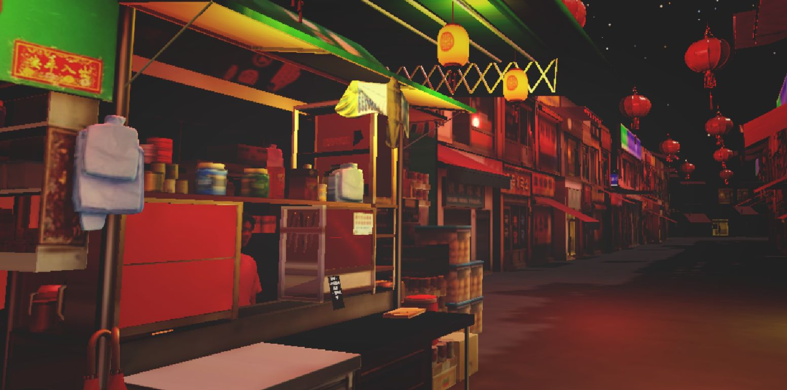
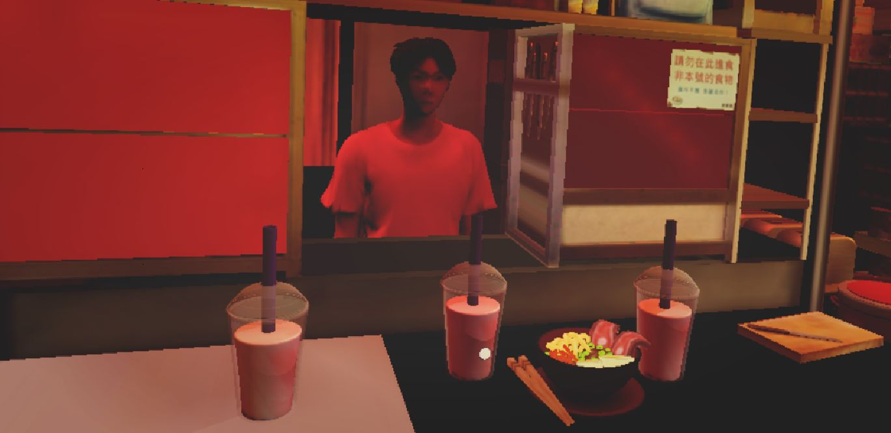
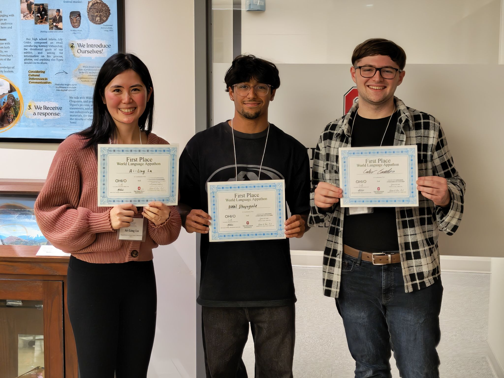

# Taiwanese Street Market Mission

**1st Place Winner — The Ohio State University World Language Appathon 2025**

Taiwanese Street Market Mission is a VR language-learning experience built in Unity that helps intermediate Mandarin learners practice real-world communication through cultural immersion and AI-powered conversation.

Developed as part of the CLLC / OHI/O World Language Appathon, the project places players in a bustling Taiwanese night market where they must complete food-ordering tasks using Mandarin Chinese. By combining virtual reality, speech recognition, natural language processing, and authentic cultural scenarios, the game creates an engaging alternative to traditional language-learning methods.

---

## Demo

### Exploring the Night Market

### Conversing with Vendors

### Appathon Champions!

---

## The Story

You are a student living with a host family in Taiwan.

One evening, your host mom texts you a list of food items she wants from the local night market. Unfortunately, your phone battery is almost dead, allowing you only a brief glance at the message before it powers off.

To complete your mission, you must navigate the market, remember the order, speak with vendors in Mandarin, and correctly purchase the requested items. Along the way, you'll practice:

* Food vocabulary
* Mandarin measure words
* Listening comprehension
* Conversational speaking skills
* Cultural knowledge of Taiwanese night markets

---

## Features

### Virtual Reality Immersion

Explore a fully interactive Taiwanese night market designed to replicate authentic cultural experiences.

### AI-Powered Conversations

Speak naturally with AI-controlled vendors using speech recognition and language processing systems that understand and respond to Mandarin input.

### Educational Design

The experience was created in collaboration with language learners and educators to reinforce practical communication skills through gameplay.

### Vocabulary & Measure Word Practice

Players strengthen their understanding of commonly used food-related vocabulary and Mandarin classifiers in meaningful contexts.

### Cultural Learning

Language acquisition is supported through authentic environmental storytelling and cultural interactions.

---

## Tech Stack

* **Unity**
* **C#**
* **Virtual Reality (VR)**
* **Speech Recognition**
* **Natural Language Processing**
* **AI Conversational Systems**

---

## Awards

🏆 **1st Place — World Language Appathon 2025**

Hosted by:

* The Ohio State University Center for Languages, Literatures, and Cultures (CLLC)
* Loann Crane Advanced Language Institute
* OHI/O

The project was recognized for its combination of technical innovation, educational effectiveness, and cultural immersion.

---

## Team

* **Caden Conde** — Developer
* **Ai-Ling Lu** — Language & Educational Design
* **Nikhil Dhayagude** — Developer

---

## Impact

This project demonstrates how interdisciplinary collaboration between software developers, language learners, and educators can create engaging educational experiences that go beyond traditional classroom instruction.

By blending VR technology with AI-driven language interaction, Taiwanese Street Market Mission provides learners with a safe, immersive environment to build confidence in real-world Mandarin communication.

---

Built for the 2025 World Language Appathon at The Ohio State University.
